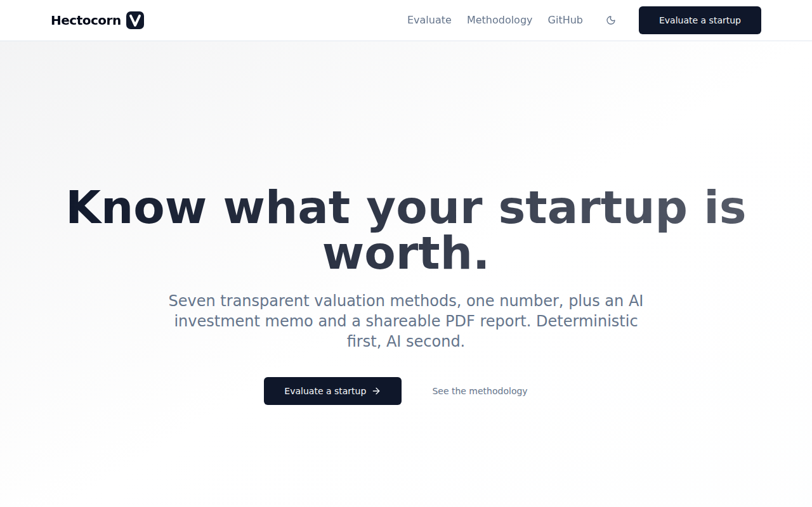
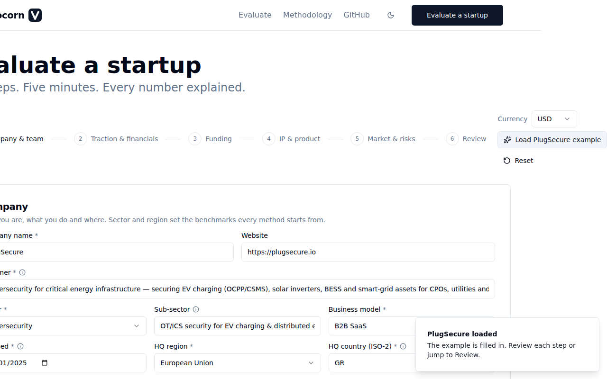
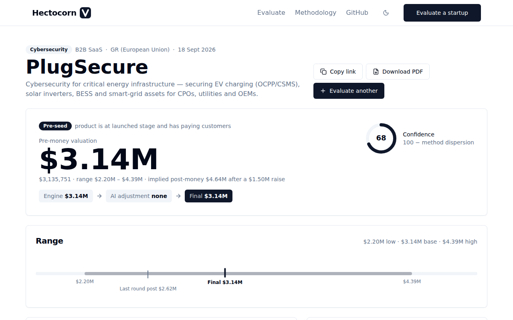

# Hectocorn V

[](https://github.com/ekarabatsakis/cpo.today/actions/workflows/hectocorn-v-ci.yml)
[](LICENSE)
[](https://nextjs.org)
[](tests/engine)
[](#quality)

**Open-source, AI-assisted startup valuation. Deterministic first, AI second.**

Fill in a structured profile of a startup (team, traction, funding, IP, market, risks) and get back:

1. A **pre-money valuation in USD** with a low / base / high range and an implied post-money.
2. A **method-by-method breakdown**: Scorecard, Berkus, Risk-Factor Summation, VC Method, Revenue Multiples and Last-Round Anchor, blended with a weighted geometric mean and sanity-checked against the market size.
3. An **AI investment memo** written by Claude: strengths, risks, comparables, what moves the number, a recommended raise and a confidence score.
4. A **sensitivity view**: eight preset what-ifs and live sliders that re-run the engine.
5. A shareable, branded **PDF report**.

The transparent formula engine produces the number. Claude scores the qualitative inputs, estimates missing market data and may adjust the final figure only inside a ±25% band with a written justification. The server clamps and recomputes everything the model returns, and the report always shows the engine number next to the final one.

| Landing                                       | Wizard                                            | Report                                     |
| --------------------------------------------- | ------------------------------------------------- | ------------------------------------------ |
|  |  |  |

## Quick start

```bash
cp .env.example .env && npm i && npx prisma migrate dev && npm run db:seed && npm run dev
```

Open http://localhost:3000, click **Evaluate a startup**, then **Load PlugSecure example** and **Run valuation**. The seeded example report is at http://localhost:3000/report/seed-plugsecure-01.

Without an `ANTHROPIC_API_KEY` the app runs fully offline and every report carries the deterministic engine result. Add a key to `.env` to enable the qualitative scorer, the market estimator (with optional web search) and the memo.

```
ANTHROPIC_API_KEY=            # optional; enables the AI layer
ANTHROPIC_MODEL=claude-sonnet-4-6
DATABASE_URL="file:./dev.db"  # SQLite by default; point at Postgres and change the provider in prisma/schema.prisma
ENABLE_WEB_SEARCH=true        # let the market estimator cite public reports
NEXT_PUBLIC_APP_URL=http://localhost:3000
```

## How it works

```
form (zod) ──► /api/valuate ──► FX → engine ──► persist row, return { id }
                                              └─► after the response:
                                                  scorer ‖ market estimator → engine re-run → memo → clamp ±25% → persist
report page ◄── /api/report/[id] ◄── DB      /api/sensitivity ◄── sliders       /report/[id]/pdf ◄── PDF
```

### Methodology in one screen

- **Stage** is inferred from the data (ARR, paying customers, last priced round, product stage). The self-declared stage only breaks ties.
- **Seven qualitative scores** (team, market, product, traction, moat, financial, deal) are computed from the inputs with published formulas; the AI scorer may override them and the report shows both.
- **Scorecard**: stage median × region factor × a weighted multiplier of the six factors.
- **Berkus**: five pre-revenue drivers, each worth up to $750k, summed (pre-$250k ARR only).
- **Risk-Factor Summation**: twelve risks rated −2…+2, each point worth $250k scaled to the stage median.
- **VC Method**: revenue at exit (or a SOM/TAM-based path when pre-revenue) × sector exit multiple ÷ target return × (1 − dilution), less the current raise.
- **Revenue Multiples**: sector EV/ARR band tilted by growth quality, margin and churn (ARR ≥ $100k).
- **Last-Round Anchor**: last priced post-money stepped up by traction, for 36 months.
- **Blend**: stage weight presets × method weight hints, weighted geometric mean, capped at 3× SOM, confidence = 100 − dispersion, range ×0.70/×1.40 (wider when confidence < 50).

The full description, with the benchmark tables, is on the app's **Methodology** page and in [`CLAUDE.md`](CLAUDE.md) §5.

### Worked example: PlugSecure

The seeded example (OT security for EV charging, Greece, pre-seed, 3 paying customers, $720k raised at $2.62M post) lands at **≈ $3.14M pre-money** offline: Scorecard $3.18M (42%), Berkus $1.90M (28%), Risk-Factor Summation $4.99M (28%), Last-Round Anchor $3.80M (3%). The VC method is skipped until a market size exists, which the AI estimator supplies when a key is configured.

## How to update benchmarks

All constants live in [`src/lib/engine/benchmarks.ts`](src/lib/engine/benchmarks.ts): stage medians, region factors, sector multiples, VC-method parameters, the Berkus cap, the RFS point value, the market ceiling multiple, FX rates and the blend presets.

1. Edit the values and the `source` / `asOf` note.
2. Bump `BENCHMARKS_VERSION` (it is printed in the footer, the audit trail and the PDF).
3. Run `npm test` and update the hand-computed expectations in `tests/engine` that changed.

## Project layout

```
src/lib/schema/startup.ts   zod schema: the single source of truth for the form, API, engine and prompts
src/lib/engine/             deterministic engine: stage, scores, methods/, blend, sensitivity, benchmarks
src/lib/ai/                 Claude client, strict tool schemas, prompts, scorer, market estimator, memo
src/lib/pipeline/           the valuate pipeline (engine → AI → persist)
src/app/                    landing, /evaluate wizard, /report/[id], /methodology, API routes, PDF route
src/components/             brand, layout, form steps, report widgets, shadcn/ui
prisma/                     SQLite schema, migrations and the PlugSecure seed
tests/engine, tests/unit    Vitest (87 tests)      tests/e2e   Playwright smoke
```

## Scripts

| Command                                                 | What it does                                                                                                           |
| ------------------------------------------------------- | ---------------------------------------------------------------------------------------------------------------------- |
| `npm run dev` / `npm run build` / `npm start`           | Next.js                                                                                                                |
| `npm test`                                              | Vitest: every method with hand-computed values, stage edge cases, the PlugSecure fixture, blend, currency, AI clamping |
| `npm run test:e2e`                                      | Playwright: load example → run → report → PDF download → live what-if (build first)                                    |
| `npm run lint` / `npm run typecheck` / `npm run format` | ESLint (zero warnings), `tsc --noEmit`, Prettier                                                                       |
| `npm run db:migrate` / `npm run db:seed`                | Prisma migrate, seed the example                                                                                       |
| `node scripts/generate-assets.mjs`                      | Regenerate `favicon.ico` and `og-image.png` from the mark                                                              |
| `node scripts/screenshots.mjs`                          | Regenerate the README screenshots from a running server                                                                |

## Quality

- **Lighthouse** (landing page, production build, headless Chromium 141): performance 99, accessibility 100, best practices 100, SEO 100.
- **Tests**: 87 Vitest tests over the engine and the AI clamping, plus a 5-test Playwright suite that loads the example, runs a valuation, opens the report, downloads the PDF and moves a what-if slider.
- **Strictness**: TypeScript strict, zero `any`, zero ESLint warnings at `npm run build`.

## Contributing

See [CONTRIBUTING.md](CONTRIBUTING.md). In short: every number needs a method trail, benchmarks live in one file with a version, the server recomputes anything the model returns, and everything must keep working offline.

## Disclaimer

> Hectocorn V produces indicative estimates for educational and discussion purposes. It is not a valuation opinion, investment advice, or a substitute for professional advice. Valuations are ultimately set by negotiation between parties.

## Licence

MIT. Brand and design system follow [hectocorn.co](https://hectocorn.co).
